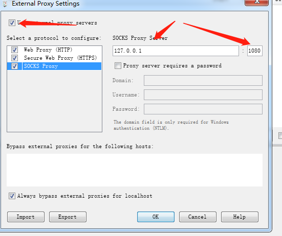

本文介绍如何设置`翻墙抓包`。

##　原因
由于部分原因我们可能需要抓`谷歌`等国内禁止访问的包，此时我们即需要翻墙有需要抓包。

## 设置`shadowsocks`

启动`shadowsocks`并设置本地监听端口为`1080`。

## 设置抓包程序

### charles(版本，fiddler 使用者请略过)

#### 设置

打开菜单`Proxy`->`External Proxy Settings...`进行配置。配置如下

#### 远程抓包手机**证书设置（关键）**

1. 手机浏览器打开`chls.pro/ssl`下载证书.
2. 安装证书（**安装证书的时候有个证书用途，记得选择 `WLAN`**）

### fiddler

fiddler 默认走系统代理，因此无需设置。如果需要手动设置：`Tools`->`Options`->`Gateway`。

#### 远程抓包手机**证书设置（关键）**

1. 手机浏览器打开`${IP}:${PORT}`下载证书.
2. 安装证书（**安装证书的时候有个证书用途，记得选择 `WLAN`**）
